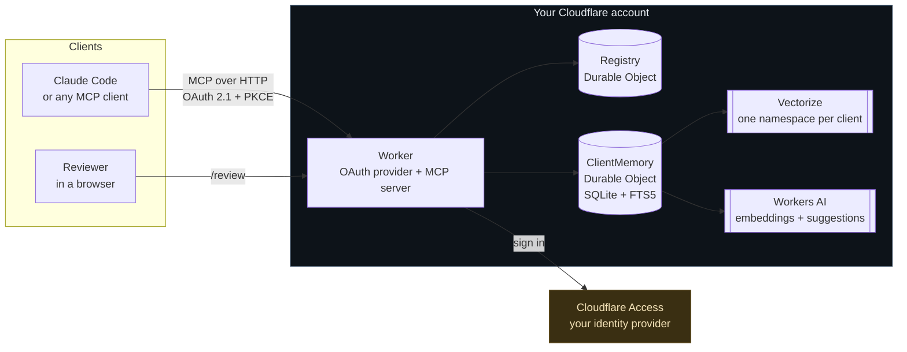
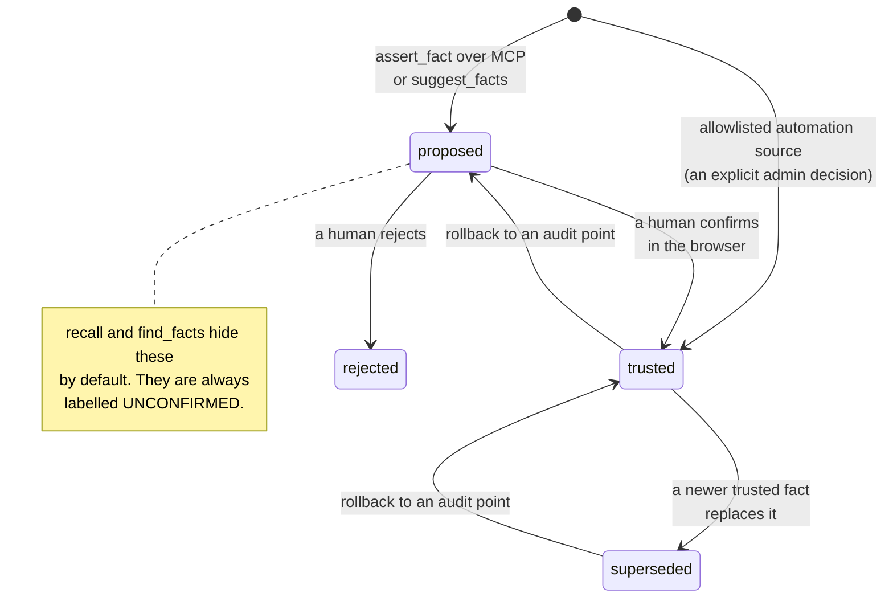
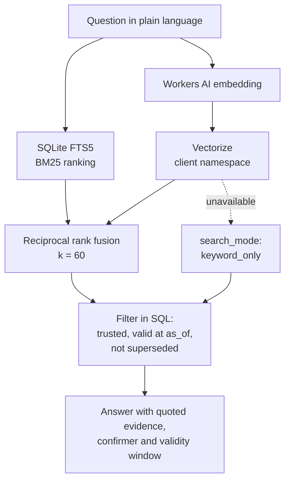

# KeenDreams Security Memory

**The open source memory layer for custom security systems.** A remote [MCP](https://modelcontextprotocol.io) server that gives your security agents and analysts a shared, evidence-backed memory: what is vulnerable, what was remediated, what was accepted as risk, who decided, and when.

It runs entirely in **your own Cloudflare account**. There are no vendor API keys, no shared secrets, and no telemetry. Nothing is sent to the authors of this project.

Every fact carries the evidence it came from. **Anything can propose a fact. Only a human, signed in through a browser, can confirm one.**


---

## Why this exists

Security agents forget. Each session starts cold, re-reads the same scan output, and re-asks questions a human already answered. Worse, an agent that simply remembers whatever it was told is a liability: a vulnerability scanner's output, a pasted chat log, or a ticket comment can all carry text that looks like an instruction.

KeenDreams Security Memory takes the opposite position. Memory is a **knowledge graph of claims, each attached to the evidence that supports it**, and trust is something a person grants, never something a model assumes.

| Without a memory layer | With KeenDreams |
|---|---|
| "Is CVE-2026-1234 on web-prod-03 already triaged?" needs a human to go look | `recall` answers with the fact, who confirmed it, and when |
| An agent re-reports a finding the team accepted as risk last month | The accepted risk is in memory with its expiry date |
| An agent believes whatever a scan output says | Scan output is stored as quoted evidence, never as instructions |
| Model-generated claims blend into facts | Suggestions are labelled `UNCONFIRMED` until a person confirms them |

---

## How it works



One `ClientMemory` Durable Object holds one client's entire memory in its own SQLite database, so two tenants never share a table. The `Registry` decides who may open which client and which automation sources are trusted.

### The trust lifecycle

This is the heart of the design. A fact's status is not a label a caller can set.



Nothing written over MCP starts trusted, whatever the caller's role. The single exception is an identity an administrator has explicitly allowlisted for a named source, for example a scheduled Tenable sync.

### Recall

`recall` fuses keyword and semantic search, then filters by trust and validity in SQL, so an unconfirmed fact can never be returned as settled.



If Vectorize or Workers AI is unavailable, recall degrades to `keyword_only` and still answers, rather than failing.

---

## The review queue

`/review` is the only place a fact becomes trusted. It lists each proposal with the evidence it rests on, who proposed it, and any flags raised during ingestion.


Every decision is written to a hash-chained, append-only audit log along with the reviewer and the time. `/admin` can verify the chain and roll back to any point.

---

## Try it in two minutes

No Cloudflare account, no sign-in setup, no configuration:

```bash
git clone https://github.com/Agent9AI/keendreams-security
cd keendreams-security
npm install
npm run demo
```

Then open **http://localhost:8787/review**. Demo mode seeds realistic evidence and drops you in as a reviewer.

Demo mode requires two independent conditions: `DEMO_MODE=on` **and** a request arriving on `localhost` or `127.0.0.1`. A deployed Worker never answers on a loopback address, so leaving the flag on cannot expose a real deployment.

---

## Deploy it for real

[](https://deploy.workers.cloudflare.com/?url=https://github.com/Agent9AI/keendreams-security)

### Prerequisites

- A Cloudflare account with Workers, Durable Objects (SQLite), Workers KV, Vectorize and Workers AI available
- A **Cloudflare Access for SaaS (OIDC)** application, which is how people sign in. Access is what connects this to your existing identity provider.
- Node.js 22 or later for local development

### Manual deploy

```bash
npx wrangler vectorize create keendreams-memory --dimensions=768 --metric=cosine
npx wrangler deploy
```

### Sign-in setup

Create an **Access for SaaS** application in Cloudflare One, set its redirect URL to `https://<your-worker>/callback`, then set these as Worker secrets:

| Secret | Where it comes from |
|---|---|
| `ACCESS_CLIENT_ID` | The Access for SaaS application |
| `ACCESS_CLIENT_SECRET` | The same application |
| `ACCESS_AUTHORIZATION_URL` | Ends in `/authorization` |
| `ACCESS_TOKEN_URL` | Ends in `/token` |
| `ACCESS_JWKS_URL` | Ends in `/jwks` |
| `COOKIE_ENCRYPTION_KEY` | `openssl rand -hex 32` |
| `ADMIN_EMAILS` | Comma-separated administrator emails |
| `SUGGEST_MODEL` | Optional. A Workers AI model, or `off` to disable suggestions. |

```bash
npx wrangler secret put ACCESS_CLIENT_ID
# ...and so on for each secret above
```

### Connect an MCP client

```bash
claude mcp add --transport http keendreams https://<your-worker>/mcp
```

The **transport is Streamable HTTP** and the **authentication method is OAuth 2.1** with PKCE and dynamic client registration. Your MCP client opens a browser, you approve the connection, you sign in through Cloudflare Access, and the client receives a token scoped to this server. No API key is ever copied or pasted.

---

## Tools

Nine tools, exposed over MCP. Five are read-only.

| Tool | Reads or writes | What it does |
|---|---|---|
| `recall` | read | Ask a question in plain language. Hybrid keyword and semantic search with quoted evidence. |
| `find_facts` | read | Exact lookup by subject, relationship, object or status, with `as_of` for past dates. |
| `get_entity` | read | Everything known about one asset, vulnerability, identity or indicator. |
| `explore_graph` | read | Walk outward across trusted relationships, up to three hops. |
| `fact_history` | read | The full timeline of one relationship, built for audits. |
| `list_proposals` | read | What is waiting for human review. |
| `record_episode` | write | Store raw evidence. Credentials are redacted before storage. |
| `assert_fact` | write | Propose a relationship, citing the episode that proves it. |
| `suggest_facts` | write | Ask your own model to read one episode and propose relationships. |

Relationships: `HAS_VULN`, `REMEDIATED`, `FALSE_POSITIVE`, `ACCEPTED_RISK`, `OWNS`, `OBSERVED`, `RELATED_TO`.

### Output shape

Every tool returns JSON. Facts always carry a `confidenceLabel` so an agent cannot mistake a proposal for something settled:

```json
{
  "client": "default",
  "search_mode": "hybrid",
  "count": 1,
  "results": [
    {
      "subject": "asset:web-prod-03",
      "predicate": "HAS_VULN",
      "object": "cve:CVE-2026-1234",
      "status": "trusted",
      "confidenceLabel": "TRUSTED",
      "confirmedBy": "alice@example.com",
      "confirmedAt": "2026-09-16T12:01:22.000Z",
      "validFrom": "2026-09-10T00:00:00.000Z",
      "validTo": null,
      "evidence": {
        "source": "tenable-hexa",
        "quote": "Tenable plugin 201455: Apache Struts remote code execution on web-prod-03..."
      }
    }
  ]
}
```

---

## Security posture

This is a memory system for security teams, so it is built against the ways memory gets abused (OWASP Agentic Security Initiative, ASI06 memory poisoning).

- **Evidence or it did not happen.** Every fact cites an episode. Nothing is stored as a bare assertion.
- **Text is data, never instructions.** Episode content is stored quoted and passed to models inside a delimited block that the prompt names as data.
- **Credential redaction on ingest.** Key-shaped and token-shaped strings are blanked before storage, and the count is recorded.
- **Instruction-like evidence is flagged** for the reviewer. A flag never raises trust.
- **Nothing is edited or deleted.** Corrections supersede; the old version stays readable, which is what makes `as_of` honest.
- **Hash-chained audit log.** Append-only, enforced by database triggers, with a chain verifier and rollback.
- **Per-principal write limits** per client.
- **SSRF protection** via the `global_fetch_strictly_public` compatibility flag.
- **Tokens are never logged**, returned, or written into memory.
- Browser pages ship a strict CSP with no scripts at all, `frame-ancestors 'none'`, and CSRF tokens on every form.

Secret scanning (gitleaks over full history), type checking, linting, CodeQL and the full test suite run on every push.

---

## Data flows

No component sends data to the authors of this project.

| From | To | What |
|---|---|---|
| MCP client | Your Worker | Tool calls over OAuth |
| Your Worker | Your Workers AI | Episode and query text, for embeddings and optional suggestions |
| Your Worker | Your Vectorize index | Embeddings and item IDs. No episode text, no metadata. |
| Your Worker | Your Cloudflare Access | OAuth code exchange and key discovery |
| Analyst's Claude Code | Tenable Hexa AI MCP | Read-only finding queries, using the analyst's own Tenable keys |

---

## Using it with Tenable

Tenable's [Hexa AI MCP server](https://docs.tenable.com/exposure-management/Content/getting-started/hexa-AI-MCP.htm) exposes your exposure data to an MCP client. Connect both servers in the same session and an analyst can pull live findings from Tenable and check them against what the team already decided.

```bash
claude mcp add --transport http tenable-hexa https://cloud.tenable.com/mcp/ \
  --header "X-ApiKeys: accessKey=<ACCESS_KEY>;secretKey=<SECRET_KEY>"
```

Your Tenable keys stay in your own MCP client configuration. This project never sees them.

> **Note:** Hexa exposes roughly 90 tools and they are not all read-only. Documented write tools include `scan_create`, `scan_launch`, `ticket_create_issue` and `ticket_notify_assignees`. Anything that reads from Hexa on your behalf should name the specific read tools it may call rather than letting a model choose.

This repository ships [`SKILL.md`](SKILL.md), a `/hexa-to-memory` skill for Claude Code that does exactly that: it allowlists four Hexa read tools by name, refuses everything that writes, checks each finding against what your team already decided, and leaves the result as proposals for review.

---

## Known limitations

Stated plainly, because a security tool that oversells itself is worse than useless.

- **Vectorize and Workers AI are not exercised by the test suite.** Both are faked locally, because the Workers test runner cannot reach them offline. Their failure paths are tested; their success paths are proven only against a real deployment.
- **`suggest_facts` depends on a model returning schema-valid JSON.** If your chosen model is unreliable, set `SUGGEST_MODEL=off`. Suggestions are a convenience, not a dependency.
- **The audit log grows without bound.** There is no retention policy yet.
- **`/admin` is minimal.** Mode, clients, members and the source allowlist are managed through Registry RPC for now.
- **Multi-client mode requires deliberate setup.** Single-client mode is the default and is what most teams want.
- **No scheduled Tenable sync is included.** Ingestion is driven by an analyst or an agent you write.

---

## Development

```bash
npm install
npm test          # 221 tests, fully offline
npm run typecheck
npm run lint
npm run demo      # localhost review queue with seeded evidence
```

Design and implementation notes live in [`docs/superpowers/`](docs/superpowers/).

---

## License

MIT. Copyright Agent9.dev.

---

<sub>Built by [Agent9.dev](https://agent9.dev/?utm_source=github&utm_medium=readme&utm_campaign=keendreams-security). If you want this integrated into your security stack, [get in touch](https://agent9.dev/?utm_source=github&utm_medium=readme&utm_campaign=keendreams-security).</sub>
