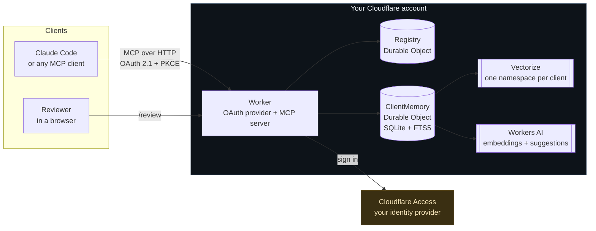
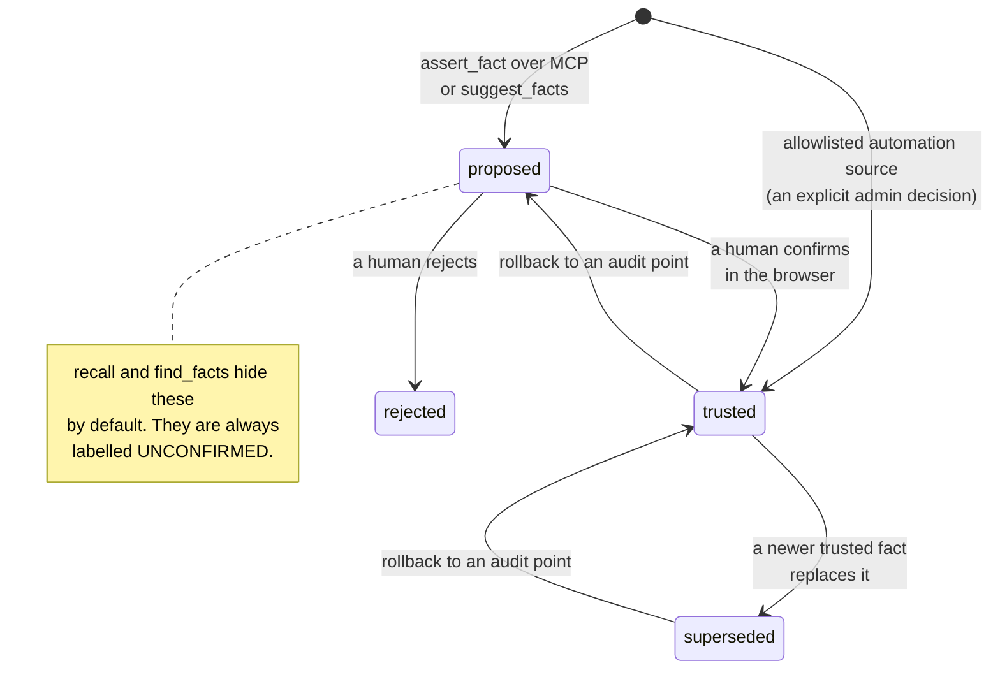
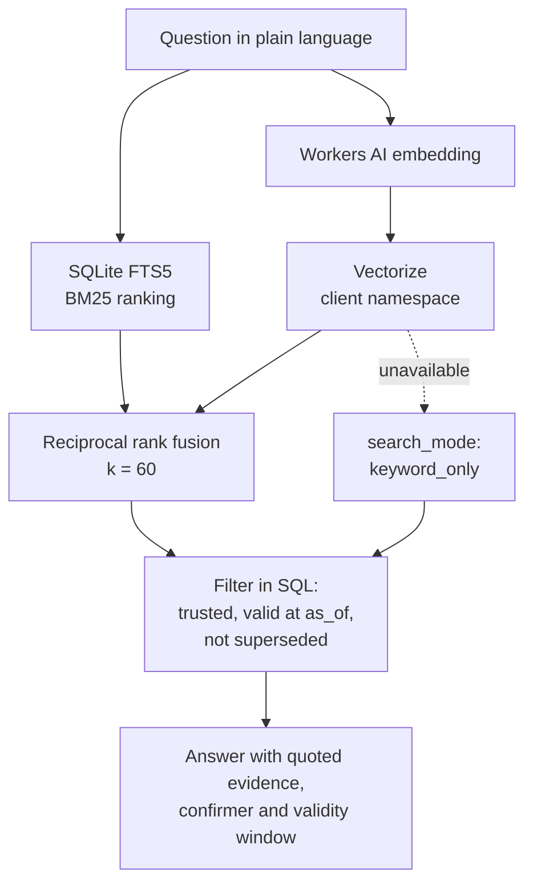

# KeenDreams Security Memory

### Your security agents keep re-investigating findings your team already closed. And an agent that believes whatever it reads is one poisoned scan result away from acting on an attacker's text.

**KeenDreams fixes both.** It is an open source, evidence-backed memory that your
agents and analysts share: what is vulnerable, what was remediated, what was
accepted as risk, who decided, and when. Every fact cites the evidence it came
from, and **only a human signed in through a browser can confirm one.**

[](https://github.com/Agent9AI/keendreams-security/actions/workflows/ci.yml)
[](https://github.com/Agent9AI/keendreams-security/actions/workflows/secret-scan.yml)
[](LICENSE)
[](#development)
[](https://modelcontextprotocol.io)

It is a remote [MCP](https://modelcontextprotocol.io) server that runs entirely in
**your own Cloudflare account**. No vendor API keys, no shared secrets, no
telemetry. Nothing reaches the authors of this project.

```bash
git clone https://github.com/Agent9AI/keendreams-security && cd keendreams-security
npm install && npm run demo      # no account, no config, no network
```

Then open **http://localhost:8787/review**.


<sub>Three facts an agent proposed from a Tenable finding, an analyst note and a
ticket, each shown with the evidence behind it. Until a human clicks Confirm, none
of them will come back from a query. The last frame is the admin page verifying
that every one of those decisions is intact in the hash-chained audit log.</sub>

> **The one-sentence version:** anything can propose a fact, nothing can promote
> itself, and every answer arrives with its provenance attached.

---

## Why this exists

The usual fix for a forgetful agent is to let it remember what it was told. For
security work that trades one problem for a worse one, because scanner output,
ticket comments and pasted chat logs are all attacker-reachable text.

KeenDreams takes the opposite position. Memory is a **knowledge graph of claims,
each attached to the evidence that supports it**, and trust is something a person
grants rather than something a model assumes.

| Without a memory layer | With KeenDreams |
|---|---|
| "Is CVE-2026-1234 on web-prod-03 already triaged?" needs a human to go look | `recall` answers with the fact, who confirmed it, and when |
| An agent re-reports a finding the team accepted as risk last month | The accepted risk is in memory with its expiry date |
| An agent believes whatever a scan output says | Scan output is stored as quoted evidence, never as instructions |
| Model-generated claims blend into facts | Suggestions are labelled `UNCONFIRMED` until a person confirms them |

---

## See it refuse to believe an agent

This is real output, captured from the test suite, not an illustration.

An agent reads a Tenable finding and records the evidence:

```jsonc
// record_episode
{ "episodeId": "e528b7aa...", "redactions": 0, "flags": [], "parts": 1 }
```

It then proposes what the evidence means:

```jsonc
// assert_fact  asset:web-prod-03  HAS_VULN  cve:CVE-2026-1234
{
  "status": "proposed",
  "confidenceLabel": "UNCONFIRMED",
  "review_url": "https://your-worker/review?client=default"
}
```

Now the important part. Ask the memory what it knows:

```jsonc
// recall "is web-prod-03 affected by anything critical"
{ "search_mode": "keyword_only", "count": 0, "results": [] }
```

**Nothing.** The agent asserted it a moment ago, and the memory will not repeat it
back, because no human has confirmed it. There is no flag to bypass this and no
role that skips it.

A reviewer opens `/review`, reads the evidence, and clicks Confirm. The same
question, asked again:

```jsonc
// recall "is web-prod-03 affected by anything critical"
{
  "search_mode": "keyword_only",
  "count": 1,
  "results": [{
    "subject": "asset:web-prod-03",
    "predicate": "HAS_VULN",
    "object": "cve:CVE-2026-1234",
    "status": "trusted",
    "confidenceLabel": "TRUSTED",
    "confirmedBy": "alice@example.com",
    "confirmedAt": "2026-09-17T15:32:13.387Z",
    "evidence": {
      "source": "tenable-hexa",
      "quote": "Tenable plugin 201455: Apache Struts remote code execution on web-prod-03. Severity Critical, CVSS 9.8, first seen 2026-09-10, still present at last scan..."
    }
  }]
}
```

The answer arrives with its provenance attached: who confirmed it, when, and the
exact evidence it rests on. Ask `fact_history` and you get the hash-chained audit
trail behind that one claim:

```jsonc
// fact_history  asset:web-prod-03  HAS_VULN  cve:CVE-2026-1234
"audit": [
  { "seq": 2, "actor": "alice@example.com", "action": "fact.assert",  "at": "...345Z" },
  { "seq": 3, "actor": "alice@example.com", "action": "fact.confirm", "at": "...387Z" }
]
```

You can reproduce every line of this yourself with `npm test`.

---

## The two pages your team actually uses

Agents talk to this over MCP. People use two browser pages, and both ship with it.

### The review queue, where facts become trusted

`/review` is the only place a proposal can be confirmed. Each one arrives with the
evidence it rests on, who proposed it, and any flags raised during ingestion. There
is no MCP tool that does this, so an agent holding a valid token still cannot
promote its own claim.


### The admin page, where you can check the thing is honest

`/admin` is limited to the people named in `ADMIN_EMAILS`, because everything on it
either grants trust or rewrites history.


- **Deployment health.** Every row is a live probe rather than a reading of the
  configuration: it queries your index, embeds a string, and asks your model for
  schema-valid JSON. You find a broken binding here instead of in front of an
  analyst. In demo mode the three cloud rows read **live only**, because a laptop
  cannot reach Vectorize or Workers AI.
- **Audit chain verification** for the client memory and the registry, naming the
  first entry whose hash does not match.
- **Rollback** to any audit entry. Decisions made after it return to proposed, and
  whatever they superseded reopens. The rollback is itself an audit entry.
- **Search index** status, with a retry for anything that gave up.
- **Clients, members, reviewers, trusted automation sources and write limits.**

---

## Where this pays off

Four situations every vulnerability programme runs into. In each one the cost is
not the finding, it is the work the finding causes a second time. Every response
below is captured from a real run, not written to look plausible.

### The same false positive, investigated three times

A scanner flags a critical CVE on `db-prod-01`. An analyst spends an afternoon
with the DBA team and establishes the affected module is not loaded in your
build. Next scan cycle, the finding is back. It is back the cycle after that too.

The determination lives in a Slack thread, a closed ticket, or the head of
whoever did the work. So the second analyst starts from zero, and the third one
does too.

```jsonc
// recall "CVE-2026-0077 db-prod-01"
{
  "predicate": "FALSE_POSITIVE",
  "status": "trusted",
  "confidenceLabel": "TRUSTED",
  "confirmedBy": "priya@example.com",
  "confirmedAt": "2026-09-17T15:48:54.174Z",
  "reason": "The affected module is not loaded in our build. Confirmed with the DBA team.",
  "evidence": {
    "source": "analyst-note",
    "quote": "Reviewed CVE-2026-0077 on db-prod-01 with the DBA team on 2026-09-12. The affected module is not loaded in our build, so this is a false positive..."
  }
}
```

The agent asks before it escalates. The second investigation never happens, and
the reason is attached to the answer rather than remembered by a person.

### The risk acceptance that quietly became permanent

Risk acceptances are where exposure hides. Someone accepts a critical finding for
a fortnight because a release is frozen, and then the fortnight ends and nothing
happens. It stays accepted, silently, until an auditor finds it.

This memory will not let you record that shape of decision:

```jsonc
// assert_fact  ACCEPTED_RISK  with no expiry
{ "isError": true, "text": "invalid_input: ACCEPTED_RISK requires validTo (an expiry date)" }

// assert_fact  ACCEPTED_RISK  with no stated reason
{ "isError": true, "text": "invalid_input: ACCEPTED_RISK requires a reason" }
```

`ACCEPTED_RISK` **cannot be recorded without an expiry date and a stated reason**.
It is enforced in the predicate rules, not left to a convention people drift from.
When the date passes, the acceptance stops being current automatically because
validity is part of the query, so there is no job to schedule and nothing to
forget. The vulnerability simply reappears as untriaged.

### The fix that silently regressed

A vulnerability is remediated and recorded. Months later a rebuild, a rollback or
a new host from an old image brings it back.

Because a newly confirmed `HAS_VULN` closes the matching `REMEDIATED` rather than
sitting alongside it, the memory ends up with one current answer and a history
showing the fix and the regression in order. You get the regression as a fact,
not as two contradictory records for a human to reconcile.

### The audit question nobody can answer quickly

> "Who decided this was acceptable, on what basis, and when does that expire?"

That question normally costs days of searching tickets and chat logs, and the
answer is often unprovable afterwards.

```jsonc
// fact_history
"audit": [
  { "seq": 2, "actor": "alice@example.com", "action": "fact.assert",  "at": "...345Z" },
  { "seq": 3, "actor": "alice@example.com", "action": "fact.confirm", "at": "...387Z" }
]
```

Every decision is an append-only, hash-chained entry that names the person and
the moment. `as_of` answers what the team believed on a past date rather than
today's view backdated, which is the difference between explaining an incident
and guessing about it.

### And the one that is about protection rather than time

Scanner output, ticket comments and pasted chat logs are attacker-reachable text.
An agent that treats its own memory as ground truth will act on a sentence
somebody planted there, which is OWASP ASI06 memory poisoning.

Here, that text is stored quoted, flagged when it looks like an instruction, and
**cannot promote itself**. No role, no token and no model output reaches `trusted`
without a person confirming it in a browser. The blast radius of a poisoned
finding is one proposal sitting in a review queue.

### Who this fits

| If you are | The part that matters |
|---|---|
| A team building security agents | Agents stop re-deriving decisions, and a poisoned input cannot become a fact |
| An analyst working in Claude Code | Ask what the team already decided before you open an investigation |
| An MSSP across many clients | One database and one vector namespace per client, so there is no shared table to leak from |
| Anyone facing an audit | Every decision already carries who, when, why and the evidence |

---

## How it works



One `ClientMemory` Durable Object holds one client's entire memory in its own SQLite database, so two tenants never share a table. The `Registry` decides who may open which client and which automation sources are trusted.

### The trust lifecycle

This is the heart of the design. A fact's status is not a label a caller can set.



Nothing written over MCP starts trusted, whatever the caller's role. The single exception is an identity an administrator has explicitly allowlisted for a named source, for example a scheduled Tenable sync.

### Recall

`recall` fuses keyword and semantic search, then filters by trust and validity in SQL, so an unconfirmed fact can never be returned as settled.



If Vectorize or Workers AI is unavailable, recall degrades to `keyword_only` and still answers, rather than failing.

---

## Try it in two minutes

No Cloudflare account, no sign-in setup, no configuration:

```bash
git clone https://github.com/Agent9AI/keendreams-security
cd keendreams-security
npm install
npm run demo
```

Then open **http://localhost:8787/review**. Demo mode seeds realistic evidence and drops you in as a reviewer.

Demo mode requires two independent conditions: `DEMO_MODE=on` **and** a request arriving on `localhost` or `127.0.0.1`. A deployed Worker never answers on a loopback address, so leaving the flag on cannot expose a real deployment.

---

## Deploy it for real

[](https://deploy.workers.cloudflare.com/?url=https://github.com/Agent9AI/keendreams-security)

### Prerequisites

- A Cloudflare account with Workers, Durable Objects (SQLite), Workers KV, Vectorize and Workers AI available
- A **Cloudflare Access for SaaS (OIDC)** application, which is how people sign in. Access is what connects this to your existing identity provider.
- Node.js 22 or later for local development

### Manual deploy

```bash
npx wrangler vectorize create keendreams-memory --dimensions=768 --metric=cosine
npx wrangler deploy
```

### Sign-in setup

Create an **Access for SaaS** application in Cloudflare One, set its redirect URL to `https://<your-worker>/callback`, then set these as Worker secrets:

| Secret | Where it comes from |
|---|---|
| `ACCESS_CLIENT_ID` | The Access for SaaS application |
| `ACCESS_CLIENT_SECRET` | The same application |
| `ACCESS_AUTHORIZATION_URL` | Ends in `/authorization` |
| `ACCESS_TOKEN_URL` | Ends in `/token` |
| `ACCESS_JWKS_URL` | Ends in `/jwks` |
| `COOKIE_ENCRYPTION_KEY` | `openssl rand -hex 32` |
| `ADMIN_EMAILS` | Comma-separated administrator emails |
| `SUGGEST_MODEL` | Optional. A Workers AI model, or `off` to disable suggestions. |

```bash
npx wrangler secret put ACCESS_CLIENT_ID
# ...and so on for each secret above
```

### Connect an MCP client

```bash
claude mcp add --transport http keendreams https://<your-worker>/mcp
```

The **transport is Streamable HTTP** and the **authentication method is OAuth 2.1** with PKCE and dynamic client registration. Your MCP client opens a browser, you approve the connection, you sign in through Cloudflare Access, and the client receives a token scoped to this server. No API key is ever copied or pasted.

---

## Tools

Nine tools, exposed over MCP. Five are read-only.

| Tool | Reads or writes | What it does |
|---|---|---|
| `recall` | read | Ask a question in plain language. Hybrid keyword and semantic search with quoted evidence. |
| `find_facts` | read | Exact lookup by subject, relationship, object or status, with `as_of` for past dates. |
| `get_entity` | read | Everything known about one asset, vulnerability, identity or indicator. |
| `explore_graph` | read | Walk outward across trusted relationships, up to three hops. |
| `fact_history` | read | The full timeline of one relationship, built for audits. |
| `list_proposals` | read | What is waiting for human review. |
| `record_episode` | write | Store raw evidence. Credentials are redacted before storage. |
| `assert_fact` | write | Propose a relationship, citing the episode that proves it. |
| `suggest_facts` | write | Ask your own model to read one episode and propose relationships. |

Relationships: `HAS_VULN`, `REMEDIATED`, `FALSE_POSITIVE`, `ACCEPTED_RISK`, `OWNS`, `OBSERVED`, `RELATED_TO`.

### Output shape

Every tool returns JSON. Facts always carry a `confidenceLabel` so an agent cannot mistake a proposal for something settled:

```json
{
  "client": "default",
  "search_mode": "hybrid",
  "count": 1,
  "results": [
    {
      "subject": "asset:web-prod-03",
      "predicate": "HAS_VULN",
      "object": "cve:CVE-2026-1234",
      "status": "trusted",
      "confidenceLabel": "TRUSTED",
      "confirmedBy": "alice@example.com",
      "confirmedAt": "2026-09-16T12:01:22.000Z",
      "validFrom": "2026-09-10T00:00:00.000Z",
      "validTo": null,
      "evidence": {
        "source": "tenable-hexa",
        "quote": "Tenable plugin 201455: Apache Struts remote code execution on web-prod-03..."
      }
    }
  ]
}
```

---

## Security posture

This is a memory system for security teams, so it is built against the ways memory gets abused (OWASP Agentic Security Initiative, ASI06 memory poisoning).

- **Evidence or it did not happen.** Every fact cites an episode. Nothing is stored as a bare assertion.
- **Text is data, never instructions.** Episode content is stored quoted and passed to models inside a delimited block that the prompt names as data.
- **Credential redaction on ingest.** Key-shaped and token-shaped strings are blanked before storage, and the count is recorded.
- **Instruction-like evidence is flagged** for the reviewer. A flag never raises trust.
- **Nothing is edited or deleted.** Corrections supersede; the old version stays readable, which is what makes `as_of` honest.
- **Hash-chained audit log.** Append-only, enforced by database triggers, with a chain verifier and rollback.
- **Per-principal write limits** per client.
- **SSRF protection** via the `global_fetch_strictly_public` compatibility flag.
- **Tokens are never logged**, returned, or written into memory.
- Browser pages ship a strict CSP with no scripts at all, `frame-ancestors 'none'`, and CSRF tokens on every form.

Secret scanning (gitleaks over full history), type checking, linting, CodeQL and the full test suite run on every push.

---

## Data flows

No component sends data to the authors of this project.

| From | To | What |
|---|---|---|
| MCP client | Your Worker | Tool calls over OAuth |
| Your Worker | Your Workers AI | Episode and query text, for embeddings and optional suggestions |
| Your Worker | Your Vectorize index | Embeddings and item IDs. No episode text, no metadata. |
| Your Worker | Your Cloudflare Access | OAuth code exchange and key discovery |
| Analyst's Claude Code | Tenable Hexa AI MCP | Read-only finding queries, using the analyst's own Tenable keys |

---

## Using it with Tenable

Tenable's [Hexa AI MCP server](https://docs.tenable.com/exposure-management/Content/getting-started/hexa-AI-MCP.htm) exposes your exposure data to an MCP client. Connect both servers in the same session and an analyst can pull live findings from Tenable and check them against what the team already decided.

```bash
claude mcp add --transport http tenable-hexa https://cloud.tenable.com/mcp/ \
  --header "X-ApiKeys: accessKey=<ACCESS_KEY>;secretKey=<SECRET_KEY>"
```

Your Tenable keys stay in your own MCP client configuration. This project never sees them.

> **Note:** Hexa exposes roughly 90 tools and they are not all read-only. Documented write tools include `scan_create`, `scan_launch`, `ticket_create_issue` and `ticket_notify_assignees`. Anything that reads from Hexa on your behalf should name the specific read tools it may call rather than letting a model choose.

This repository ships [`SKILL.md`](SKILL.md), a `/hexa-to-memory` skill for Claude Code that does exactly that: it allowlists four Hexa read tools by name, refuses everything that writes, checks each finding against what your team already decided, and leaves the result as proposals for review.

---

## Known limitations

Stated plainly, because a security tool that oversells itself is worse than useless.

- **New evidence takes one to two minutes to become searchable by meaning.** Vectorize indexes asynchronously; in the live verification a new vector became queryable after 69 and 121 seconds on two runs. Keyword search sees it immediately, and `recall` uses both, so a fresh finding is still found by its words straight away.
- **Sign-in has not yet been exercised end to end against a live Cloudflare Access application, and no real Claude Code client has completed that sign-in.** The OAuth flow is covered by tests against a faithful stand-in for Access, and the deployed endpoints answer correctly, but that last hop has not run for real.
- **The Tenable Hexa recipe has not been run against a live Tenable One tenant.** Its safety design, an explicit allowlist of read tools, is documented and reviewable, but the recipe itself is unverified in production.
- **`suggest_facts` depends on a model returning schema-valid JSON.** The default model does, verified live. If you choose another and it is unreliable, set `SUGGEST_MODEL=off`, and the admin page will tell you. Suggestions are a convenience, not a dependency.
- **The audit log grows without bound.** There is no retention policy yet.
- **Multi-client mode requires deliberate setup.** Single-client mode is the default and is what most teams want.
- **No scheduled Tenable sync is included.** Ingestion is driven by an analyst or an agent you write.

---

## Development

```bash
npm install
npm test          # 237 tests, fully offline
npm run verify:live   # against your own Cloudflare account, see below
npm run typecheck
npm run lint
npm run demo      # localhost review queue with seeded evidence
```

The architecture and the reasoning behind it are written up in [`docs/design.md`](docs/design.md).

### Verified against live infrastructure

`npm test` runs offline, which means Vectorize and Workers AI are stand-ins there.
So they were also run for real, on 2026-09-17, against a Cloudflare account:

| Check | Result |
|---|---|
| Workers KV, Vectorize, embeddings, suggestions | All four health probes passed |
| Embedding model | 768 dimensions, matching the index |
| Queue drain, embed and upsert | Completed in about one second |
| New vector becomes queryable | 69 s and 121 s on two runs |
| `recall` on a question phrased differently from the evidence | Answered in `hybrid` mode with the confirmed fact |
| `suggest_facts` reading a change ticket | Proposed three correct relationships (ownership, remediation, related ticket), dropped one malformed, stored all as unconfirmed |

That run also caught a real bug the offline suite could not: with a JSON schema
requested, the default model returns its answer already parsed, and the first
version of this code only accepted text, so every suggestion failed in
production. It was fixed test first, from the response shapes the real model
returned.

To repeat the verification in your own account:

```bash
npx wrangler vectorize create keendreams-memory --dimensions=768 --metric=cosine
CLOUDFLARE_ACCOUNT_ID=<your account id> npm run verify:live
```

It makes a handful of Workers AI calls and writes three vectors into a throwaway
namespace, then deletes them.

---

## Want it running in your stack this week?

Everything here is MIT licensed and yours to run. Nothing is held back, there is
no paid tier, and no feature is gated behind a conversation.

That said, a memory layer is only as good as the decisions wired into it, and the
setup that matters is the part this README cannot do for you: which sources your
team trusts, who reviews what, and how it meets the tooling you already run.

**Agent9.dev offers a deploy and integrate package:**

- Deployment into **your** Cloudflare account, not ours. You own the Worker, the
  data and the billing on day one, and you can fire us without migrating anything.
- Cloudflare Access for SaaS configured against your existing identity provider,
  with reviewers and administrators mapped to your actual teams.
- The Hexa recipe connected to your Tenable One tenant, with the read-tool
  allowlist tuned to your workflow.
- Working sessions with the analysts and reviewers who will use it, because the
  review queue only pays off if people trust it enough to use it.
- Custom ingestion for the scanners, ticketing and chat tools you already run.

[**Talk to Agent9.dev about an integration**](https://agent9.dev/keendreams-security?utm_source=github&utm_medium=readme&utm_campaign=keendreams-security)

We build agent infrastructure for security teams. If you would rather run it
yourself, the entire thing is above, and issues and pull requests are welcome.

---

## License

MIT. Copyright Agent9.dev.

---

<sub>Built by <a href="https://agent9.dev/keendreams-security?utm_source=github&utm_medium=readme&utm_campaign=keendreams-security">Agent9.dev</a>.</sub>
