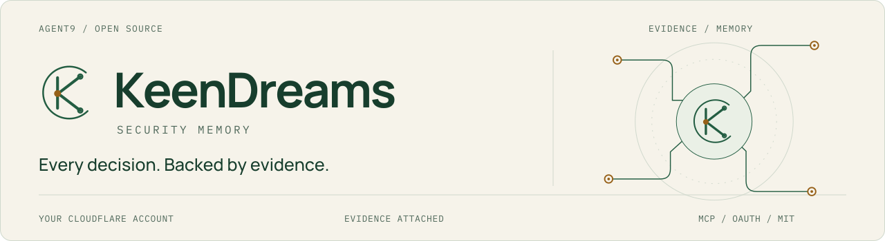
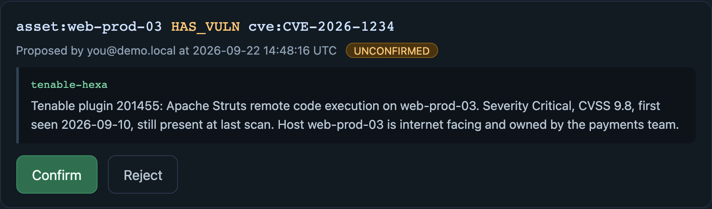
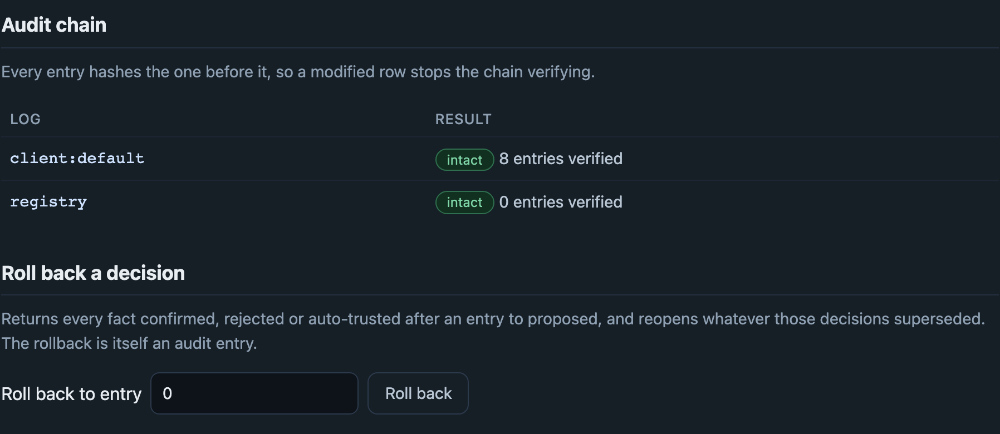
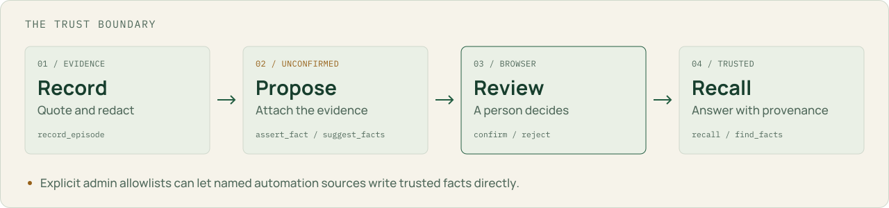
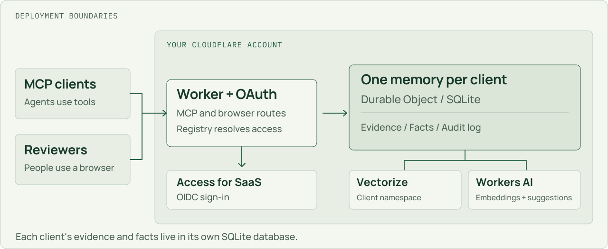

<p>
<picture>
  <source media="(prefers-color-scheme: dark) and (max-width: 600px)" srcset="docs/brand/hero-mobile-dark.svg">
  <source media="(max-width: 600px)" srcset="docs/brand/hero-mobile-light.svg">
  <source media="(prefers-color-scheme: dark)" srcset="docs/brand/hero-dark.svg">
  
</picture>
</p>

<p align="left">
  <a href="https://github.com/Agent9AI/keendreams-security/actions/workflows/ci.yml"></a>
  <a href="https://github.com/Agent9AI/keendreams-security/actions/workflows/codeql.yml"></a>
  <a href="https://github.com/Agent9AI/keendreams-security/actions/workflows/secret-scan.yml"></a>
  <a href="LICENSE"></a>
</p>

**Start the next investigation with the decisions your team already made.**

KeenDreams Security gives agents and analysts a shared record of findings,
evidence, and review decisions. It runs as an open-source MCP server in **your
own Cloudflare account**, with a separate memory for each client and a history
behind each answer.

[**Product tour**](#the-product-in-two-pages) &nbsp;·&nbsp;
[Deploy](docs/deployment/README.md) &nbsp;·&nbsp;
[Architecture](docs/architecture.md) &nbsp;·&nbsp;
[Tool reference](docs/reference/mcp-tools.md) &nbsp;·&nbsp;
[Documentation](docs/README.md)

<a id="the-product-in-two-pages"></a>

## Review the evidence

**See what supports the claim before making the decision.** The review queue
places the proposed relationship, its source, the quoted evidence, and the
reviewer's actions together.

<p>
<a href="docs/product-tour.md#review-queue">
<picture>
  <source media="(max-width: 600px)" srcset="docs/images/review-detail-mobile.png">
  
</picture>
</a>
</p>

<sub>Review queue detail. Captured from the local demo with sample evidence.</sub>

**Inspect the history behind the answer.** Administrators can verify the audit
chain and roll decisions back to an earlier entry. The rollback is itself recorded.

<p>
<a href="docs/product-tour.md#administration">
<picture>
  <source media="(max-width: 600px)" srcset="docs/images/audit-detail-mobile.png">
  
</picture>
</a>
</p>

<sub>Administration detail. Captured from the same local demo. <a href="docs/product-tour.md">Open the full product tour</a>.</sub>

<details>
<summary>Watch the review queue turn proposals into decisions</summary>


The sequence ends on the admin page, where the recorded decisions are checked
against the hash chain. [Walk through the actual tool responses](docs/walkthrough.md).

</details>

For a hands-on evaluation, [run the local demo](docs/local-demo.md) with sample
data on your own computer, or follow the [deployment guide](docs/deployment/README.md)
to host KeenDreams Security in your Cloudflare account.

<a id="evidence-first-trust-is-a-separate-decision"></a>

## Trust is a separate decision

<p>
<picture>
  <source media="(prefers-color-scheme: dark) and (max-width: 600px)" srcset="docs/brand/trust-path-mobile-dark.svg">
  <source media="(max-width: 600px)" srcset="docs/brand/trust-path-mobile-light.svg">
  <source media="(prefers-color-scheme: dark)" srcset="docs/brand/trust-path-dark.svg">
  
</picture>
</p>

1. **Record** raw evidence as a quoted episode. Credential-shaped strings are redacted.
2. **Propose** a relationship that cites that episode. New facts extracted by a model start unconfirmed.
3. **Review** in a signed-in browser. There is no MCP tool that confirms a proposal.
4. **Recall** trusted, currently valid facts with their evidence and decision history.

Administrators can separately allowlist a specific automation identity and source
to write trusted facts. A caller cannot grant itself that permission or choose a
trusted status. [Read the trust model](docs/architecture.md#the-trust-lifecycle).

For the ordinary MCP path, the result is observable: a newly proposed fact is
absent from default recall; after browser confirmation, it appears with its
provenance. [See the reproducible walkthrough](docs/walkthrough.md).

## What your team gets back

| The recurring problem | The useful answer |
|---|---|
| A finding was already investigated | Retrieve the earlier decision and its supporting evidence. |
| A risk acceptance outlived its intended window | An expiry and reason are required; expired acceptances stop appearing as current. |
| A previously fixed vulnerability returns | A newly trusted finding supersedes the remediation, preserving the timeline. |
| An auditor asks who decided and why | Inspect the actor, time, evidence, and history of the relationship. |
| One service is unavailable | Recall falls back to keyword search when the vector or embedding service fails. |

[Explore the workflows](docs/walkthrough.md#practical-workflows).

<a id="how-it-runs"></a>

## Your account. Your memory.

<p>
<picture>
  <source media="(prefers-color-scheme: dark) and (max-width: 600px)" srcset="docs/brand/architecture-mobile-dark.svg">
  <source media="(max-width: 600px)" srcset="docs/brand/architecture-mobile-light.svg">
  <source media="(prefers-color-scheme: dark)" srcset="docs/brand/architecture-dark.svg">
  
</picture>
</p>

Each client gets a Durable Object with SQLite and full-text search. Vectorize
adds semantic recall in a separate namespace for that client. Workers AI supplies
embeddings and optional suggestions. A registry controls access and trusted sources.

| Boundary | Implementation |
|---|---|
| Identity | Cloudflare Access for SaaS, OAuth 2.1, PKCE, and dynamic client registration |
| Memory | Per-client SQLite, evidence-linked relationships, validity windows, and history |
| Retrieval | Keyword + vector search, followed by trust and validity filtering |
| Human control | Browser review, administrative allowlists, and audited rollback |
| Ownership | Your Worker, account, data, model configuration, and billing |

[Architecture and diagrams](docs/architecture.md) ·
[Security model and data flows](docs/security.md)

## Tools

Nine MCP tools. **Six reads, three writes.** All four behavior hints are explicit.

| Read | Purpose | Write | Purpose |
|---|---|---|---|
| `recall` | Ask in plain language | `record_episode` | Store quoted evidence |
| `find_facts` | Filter exact relationships | `assert_fact` | Propose an evidence-linked fact |
| `get_entity` | Inspect one entity | `suggest_facts` | Propose relationships from an episode |
| `explore_graph` | Follow trusted relationships | | |
| `fact_history` | Inspect the full timeline | | |
| `list_proposals` | Inspect the review queue | | |

[Full tool reference, output examples, and annotations](docs/reference/mcp-tools.md).

## Deploy in your account

[](https://deploy.workers.cloudflare.com/?url=https://github.com/Agent9AI/keendreams-security/tree/main/worker)

The [deployment guide](docs/deployment/README.md) covers prerequisites, bindings,
settings, and connecting an MCP client. The deployer owns the infrastructure;
there is no service operated by Agent9 that receives your evidence.

### Sign-in setup

Configure Cloudflare Access for SaaS and the Worker secrets, then connect your
MCP client. [Follow the sign-in instructions](docs/deployment/README.md#sign-in-setup).

### Using it with Tenable

The included [`/hexa-to-memory` skill](SKILL.md) uses an explicit allowlist of
Hexa read tools to compare findings with prior decisions and record proposals.
[Integration guide](docs/integrations/tenable.md) ·
[Exchange submission status](docs/exchange/README.md).

<a id="security-posture-and-verification"></a>

## Built to be inspected

**237 tests across 26 files**, plus typechecking, lint, CodeQL, and full-history
secret scanning. The badges above open the actual workflow results.

Live checks on September 17, 2026 verified Workers AI, Vectorize, hybrid recall,
and model-generated proposals. They also found a production response-format bug
that the offline stand-ins missed; the fix is covered by regression tests.

> **Still to verify:** the Hexa recipe against a live Tenable One tenant.
> Semantic indexing is asynchronous, and the audit log has no retention policy
> yet. [Evidence, procedures, and all known limitations](docs/verification.md).

For vulnerability reports, use the [private reporting process](.github/SECURITY.md).

## Repository map

| Location | What belongs here |
|---|---|
| [`worker/`](worker/) | Self-contained application, package manifest, and deployment configuration |
| [`worker/src/`](worker/src/) | Authentication, memory, policy, search, and browser pages |
| [`worker/tests/`](worker/tests/) | Offline suite, fixtures, and opt-in live checks |
| [`docs/`](docs/README.md) | Guides, reference, verification, screenshots, and the brand kit |
| [`.github/`](.github/) | CI, security scans, contribution guidelines, and issue templates |
| [`SKILL.md`](SKILL.md) | Discoverable Hexa-to-memory skill |
| [`worker/wrangler.jsonc`](worker/wrangler.jsonc) | Portable Cloudflare deployment configuration |

The root keeps the entry points. Supporting configuration lives beside the code
or tests it serves. [Find your way through the documentation](docs/README.md).

## Development

<a id="try-it-locally"></a>

The [local demo guide](docs/local-demo.md) covers prerequisites, startup, and
opening the review and administration pages on your own computer.

```bash
cd worker
npm ci
npm run typecheck
npm run lint
npm test
npm run demo
```

Run these commands from `worker/`. `npm run types` regenerates bindings under `worker/src/`.
`npm run verify:live` is an opt-in check against your own account.
[Contributing](.github/CONTRIBUTING.md) · [Live verification](docs/verification.md#live-infrastructure).

---

**Built by [Agent9](https://agent9.dev/?utm_source=github&utm_medium=readme&utm_campaign=keendreams-security). Owned by you.**

MIT licensed. The complete implementation is here. For deployment, identity setup,
and integration with your team's scanners and workflows,
[work with Agent9](https://agent9.dev/?utm_source=github&utm_medium=readme&utm_campaign=keendreams-security).
