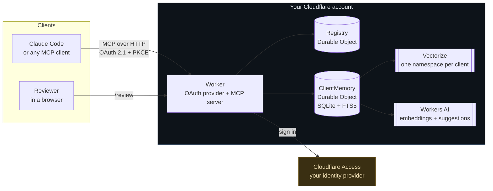
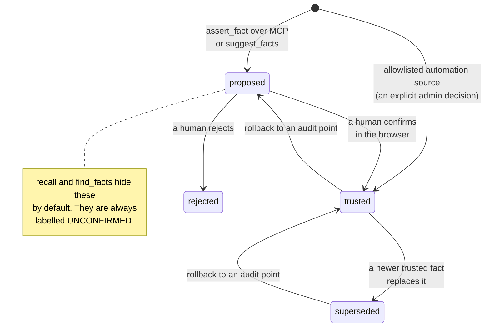
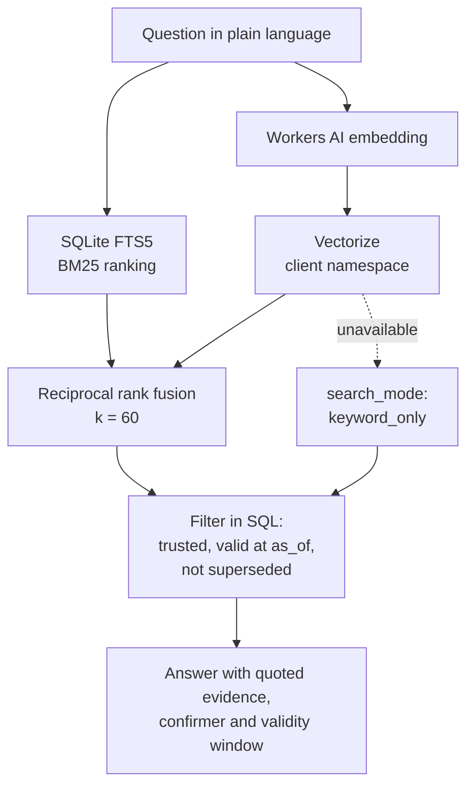

[Repository](../README.md) / [Documentation](README.md) / Architecture

# Architecture

KeenDreams separates raw evidence, proposed claims, and trusted decisions. This
page describes the implemented system; the longer [design record](design.md)
preserves the original design rationale.

One `ClientMemory` Durable Object holds one client's entire memory in its own SQLite database, so two tenants never share a table. The `Registry` decides who may open which client and which automation sources are trusted.

### The trust lifecycle

This is the heart of the design. A fact's status is not a label a caller can set.

Nothing written over MCP starts trusted, whatever the caller's role. The single exception is an identity an administrator has explicitly allowlisted for a named source, for example a scheduled Tenable sync.

### Recall

`recall` fuses keyword and semantic search, then filters by trust and validity in SQL, so an unconfirmed fact can never be returned as settled.

If Vectorize or Workers AI is unavailable, recall degrades to `keyword_only` and still answers, rather than failing.
