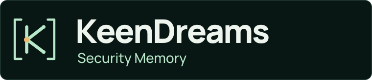

[Repository](../../README.md) / [Documentation](../README.md) / Brand kit

# KeenDreams identity

**Every decision. Backed by evidence.**

KeenDreams is security memory with a visible chain of evidence. The identity pairs
an open memory loop with a K-shaped trace: several observations converge on a
record, and the record remains open to later evidence and review.



## Principles

- **Evidence before decoration.** Show actual screens, reproducible behavior, and clear boundaries.
- **Calm, precise, accountable.** Short statements; concrete outcomes; no unearned security promises.
- **A recognizable system.** The same mark, typography, palette, and trace geometry across assets.
- **Useful in both themes.** Separate light and dark artwork, with no transparent text or remote fonts.

The Chucks architecture dossier was the quality reference. KeenDreams has its own
mark and editorial direction; it does not reuse the client's insignia or artwork.

## Palette

| Role | Light | Dark |
|---|---|---|
| Canvas | `#F6F3EA` · archive paper | `#0B1815` · deep forest |
| Primary text | `#173E2D` | `#F3F0E7` |
| Secondary text | `#4F685A` | `#A6BEB2` |
| Evidence trace | `#235D42` | `#BFE5CD` |
| Decision accent | `#966018` | `#E9B86B` |
| Hairline | `#CFD8CC` | `#30483D` |

Amber marks a decision or an unconfirmed state. It is not a universal success
color. Meaning must also be stated in text; color alone never carries trust.

## Typography and accessibility

Manrope supplies the wordmark, headings, and explanatory text. IBM Plex Mono
supplies interface labels and code-adjacent captions. Both source subsets and
their SIL Open Font Licenses are preserved in [`fonts/`](fonts/).

The SVG exports outline text for predictable rendering inside GitHub images.
Every asset carries a title and description. When embedding it, add useful alt
text and keep the important explanation in ordinary Markdown too. The images
are static and need no animation, script, external font, or remote resource.

## Assets

| Asset | Intended use |
|---|---|
| [`hero-light.svg`](hero-light.svg), [`hero-dark.svg`](hero-dark.svg) | README cover, 1280 × 350 |
| [`hero-mobile-light.svg`](hero-mobile-light.svg), [`hero-mobile-dark.svg`](hero-mobile-dark.svg) | Narrow-screen cover, 640 × 330 |
| [`mark.svg`](mark.svg) | Square mark, 128 × 128 |
| [`wordmark.svg`](wordmark.svg) | Horizontal identity, 700 × 148 |
| [`trust-path-light.svg`](trust-path-light.svg), [`trust-path-dark.svg`](trust-path-dark.svg) | Evidence-to-recall explanation, 1280 × 300 |
| [`social-preview.svg`](social-preview.svg), [`social-preview.png`](social-preview.png) | Repository social preview, 1280 × 640 |

The social preview PNG is ready for GitHub's repository **Settings → Social
preview** field. Committing an image does not configure that field automatically.

## Rebuild

Artwork is original, deterministic vector geometry. No generated product UI or
illustrative security finding is presented as a real screenshot.

```bash
python3 -m venv /tmp/keendreams-brand-env
/tmp/keendreams-brand-env/bin/pip install -r docs/brand/requirements.txt
/tmp/keendreams-brand-env/bin/python docs/brand/build.py
```

[`build.py`](build.py) defines the layout, text, color tokens, mark, and diagrams.
It reads only the included fonts and writes the SVGs beside itself. Export
`social-preview.svg` at its native 1280 × 640 size when refreshing the PNG.

Keep the mark's proportions and clear space. Do not recolor the trust states
independently, add endorsements, or use the artwork to imply that a deployment
or Tenable integration has been verified when it has not.
