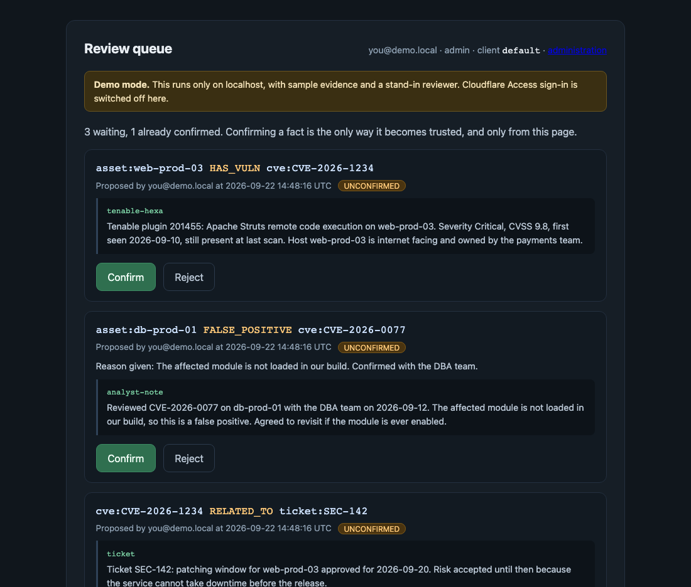
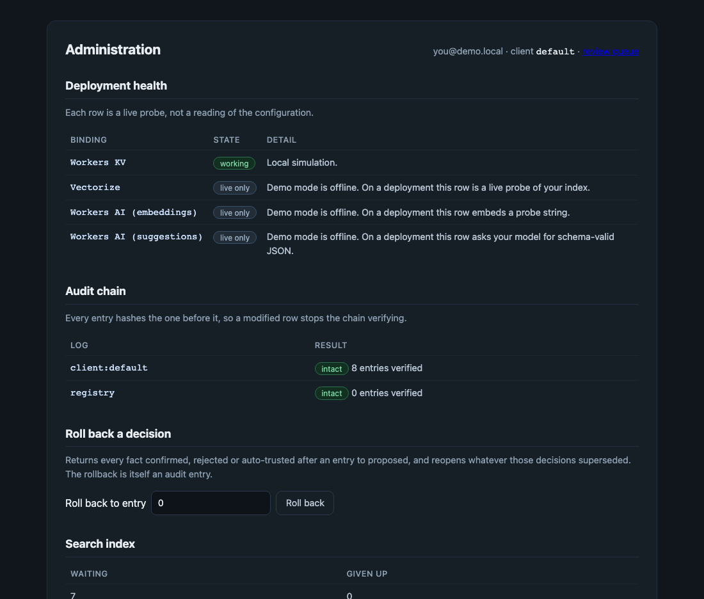
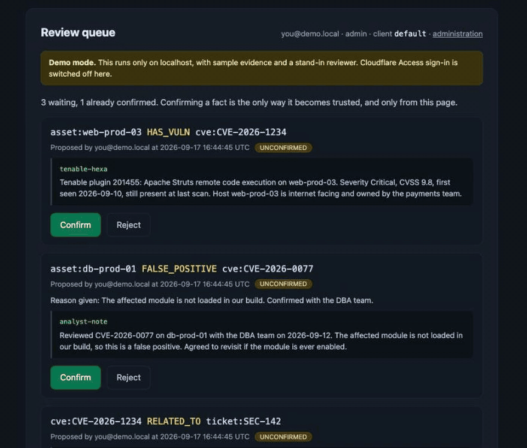

[Repository](../README.md) / [Documentation](README.md) / Product tour

# Review, decide, inspect

Agents use KeenDreams Security over MCP. Reviewers and administrators use two
browser pages. The screenshots here are actual captures from the local demo,
using synthetic evidence and a demo identity. They do not represent a customer
estate or a completed live Access sign-in.

## Review queue

Each proposal shows the relationship, who recorded it, the evidence source, and a
quoted excerpt. A reviewer can confirm or reject it. The default recall path
excludes unconfirmed proposals.

The MCP interface has no confirmation tool. Administrators may separately trust
an explicitly allowlisted automation identity and source; that exception is
covered in the [trust model](architecture.md#the-trust-lifecycle).

## Administration

The administration page verifies audit chains, supports rollback, reports search
index state, and manages client access, reviewers, and trusted automation sources.
On a deployment, the health checks probe the actual services. In the demo, remote
AI and vector checks are labelled **live only**.

A rollback is an audited state change. It returns decisions after the chosen
audit point to proposed and reopens the facts those decisions superseded.

## Watch the review sequence

This recorded sequence uses sample data. For the corresponding MCP calls and
responses, follow the [evidence-to-decision walkthrough](walkthrough.md).

## Evaluate it

- [Run the local demo](local-demo.md) to try the browser workflow with sample data.
- [Deploy in your own account](deployment/README.md) to configure identity and real services.
- [Read the verification record](verification.md) for completed checks and current limits.
